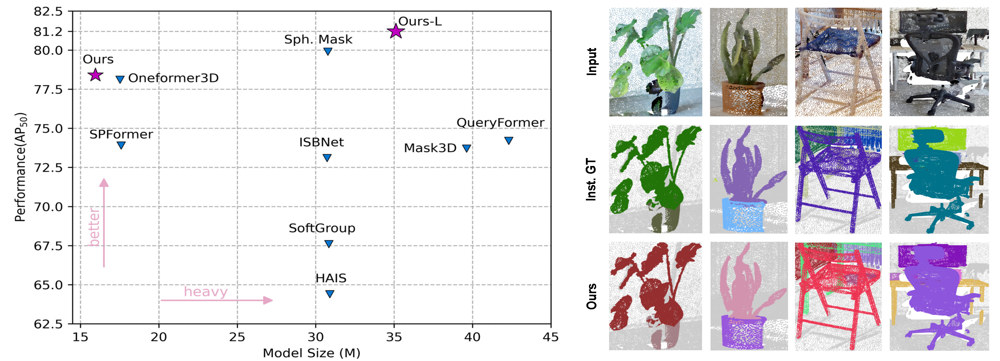

<div align="center">

# SGFormer: Semantic Guided and Geometric Enhanced Interleaving Transformer for 3D Instance Segmentation

[](https://github.com/pre-commit/pre-commit)
[](LICENSE)

[**Paper**]() | [**Project Page**]() | [**Weights**](https://huggingface.co/RayYoh/SGFormer)

Paper and codes will be coming soon.

</div>

<p align="center">
    
</p>

This is the official implementation of paper "SGFormer: Semantic Guided and Geometric Enhanced Interleaving Transformer for 3D Instance Segmentation".

<details>
<summary><b> SGFormer achieves the SOTA performance on ScanNet++ test set for 3D instance segmentation benchmark. Test scores accessed on 24 June 2024. </b></summary>


</details>

## :memo:To-Do List
- [x] Release trained weights and experiment record.
- [ ] Installation instructions.
- [ ] Processing datasets.
- [ ] Release training configs.
- [ ] Release training code.
- [ ] Release visualization code.


## :floppy_disk: Trained Weights
 | Model | Benchmark | Num GPUs | mAP | AP50 | Config  | Exp Record | Model |
| :---: | :---: | :---: | :---: | :---: | :---: | :---: | :---: |
| SGFormer-T | ScanNet++ Val | 4 | 23.9 | 37.5 |   | [Link](https://huggingface.co/RayYoh/SGFormer/raw/main/insseg-scannetpp-sgformer-t-spunet/train.log)  | [Link](https://huggingface.co/RayYoh/SGFormer/blob/main/insseg-scannetpp-sgformer-t-spunet/model/model_best.pth)  |
| SGFormer-T | ScanNet Val | 4 | 58.9 | 78.4  |   | [Link](https://huggingface.co/RayYoh/SGFormer/raw/main/insseg-scannet-sgformer-t-spunet/train.log) | [Link](https://huggingface.co/RayYoh/SGFormer/blob/main/insseg-scannet-sgformer-t-spunet/model/model_best.pth) |
| SGFormer | ScanNet Val | 4 | 61.0 | 81.2 |   | [Link](https://huggingface.co/RayYoh/SGFormer/blob/main/insseg-scannet-sgformer-spunet/train.log) | [Link](https://huggingface.co/RayYoh/SGFormer/blob/main/insseg-scannet-sgformer-spunet/model/model_best.pth) |
| SGFormer-T | ScanNet200 Val | 4 | 28.9 | 38.6  |   | [Link](https://huggingface.co/RayYoh/SGFormer/blob/main/insseg-scannet200-sgformer-t-spunet/train.log) | [Link](https://huggingface.co/RayYoh/SGFormer/blob/main/insseg-scannet200-sgformer-t-spunet/model/model_best.pth) |
| SGFormer | ScanNet200 Val | 4 | 29.2 | 39.4 |   | [Link](https://huggingface.co/RayYoh/SGFormer/raw/main/insseg-scannet200-sgformer-t-spunet/train.log) | [Link](https://huggingface.co/RayYoh/SGFormer/blob/main/insseg-scannet200-sgformer-t-spunet/model/model_best.pth) |


## :books: License

This repository is released under the [MIT license](LICENSE).

## :clap: Acknowledgement

Our code is primarily built upon [Pointcept](https://github.com/Pointcept/Pointcept), [OneFormer3D](https://github.com/oneformer3d/oneformer3d), [Mask3D](https://github.com/JonasSchult/Mask3D), [SPFormer](https://github.com/sunjiahao1999/SPFormer), [Spherical Mask](https://github.com/yunshin/SphericalMask). We also thank [Pytorch Lightning](https://github.com/Lightning-AI/pytorch-lightning), [Point Cloud Matters](https://github.com/HaoyiZhu/PointCloudMatters?tab=readme-ov-file), and [Mask3D](https://github.com/JonasSchult/Mask3D) for their excellent templates.

## :pencil: Citation

```bib
@article{yao2024sgformer,
  author= {Lei Yao},
  title= {SGFormer: Semantic Guided and Geometric Enhanced Interleaving Transformer for 3D Instance Segmentation},
  journal= {xxx},
  year= {2024},
}
```